# Demand Forecasting with Machine Learning

[](https://www.python.org/)
[](https://neon.tech/)
[](https://scikit-learn.org/)
[](#milestone-2-findings-demand-exploration--problem-framing)
[](https://opensource.org/licenses/MIT)

> **Operations Objective:** Forecast weekly demand across product categories to optimize inventory replenishment, prevent costly stockouts, and minimize inventory holding costs across **40,000 orders** and **14 commercial categories**.

---

## Business Problem & Context

In high-growth e-commerce operations, inaccurate demand planning creates two symmetrical financial liabilities:
1. **Stockouts on High-Velocity SKUs:** Lost gross merchandise value (GMV), degraded customer trust, and compromised marketing ROI.
2. **Over-Ordering on Low-Velocity SKUs:** Bloated working capital, increased warehouse storage fees, and eventual inventory markdowns or write-offs.

This project implements an end-to-end, leakage-free machine learning demand forecasting pipeline built on transactional order data from **40,000 customer orders** across **14 active product categories** and **4,000 catalog products**.

---

## End-to-End System Architecture

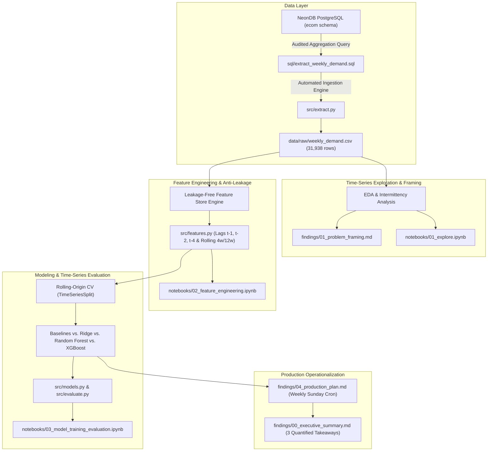

---

## Repository Structure & Components

| Component / Layer | Path | Operational Role | Anti-Leakage & Governance Safeguard |
| :--- | :--- | :--- | :--- |
| **Pipeline Query** | [`sql/extract_weekly_demand.sql`](sql/extract_weekly_demand.sql) | Aggregates transactional line items to weekly category and product volume | Filters strictly on finalized order states (`paid`, `delivered`, `shipped`) |
| **Ingestion Engine** | [`src/extract.py`](src/extract.py) | Connects to NeonDB via environment variables; caches raw series | Reads [.env](.env) securely; outputs to git-ignored `data/raw/` |
| **EDA Notebook** | [`notebooks/01_explore.ipynb`](notebooks/01_explore.ipynb) | Exploratory analysis of trend, volatility, stationarity, and sparsity | Verified clean top-to-bottom run with embedded analytical plots |
| **Problem Brief** | [`findings/01_problem_framing.md`](findings/01_problem_framing.md) | Formal executive brief defining target, granularity, horizon, and metric | Justifies WMAPE over MAPE and resolves SKU sparsity dilemma |
| **Feature Generator** | [`src/features.py`](src/features.py) | Modular feature pipeline constructing lag and rolling window features | Strict shift indexing preventing lookahead leakage |
| **Feature Notebook** | [`notebooks/02_feature_engineering.ipynb`](notebooks/02_feature_engineering.ipynb) | Demonstrates feature extraction, correlation, and temporal splits | Enforces temporal boundary checks across validation folds |
| **Model Estimators** | [`src/models.py`](src/models.py) | Persistence, Seasonal Naive, Ridge, Random Forest, and XGBoost models | Scikit-learn estimator interface with standardized API |
| **Evaluation Engine** | [`src/evaluate.py`](src/evaluate.py) | Rolling-origin cross-validation (`TimeSeriesSplit`) and scoring | Calculates WMAPE, MAE, and RMSE strictly out-of-fold |
| **Model Benchmark** | [`notebooks/03_model_training_evaluation.ipynb`](notebooks/03_model_training_evaluation.ipynb) | Model comparison, hyperparameter sweeps, and residual analysis | Simulates real-time weekly forward inference |
| **Executive Memo** | [`findings/00_executive_summary.md`](findings/00_executive_summary.md) | High-level synthesis with 3 quantified operational takeaways | Written in clear executive language for the Operations Director |
| **Production Plan** | [`findings/04_production_plan.md`](findings/04_production_plan.md) | Deployment architecture, weekly inference cadence, drift alerts, retraining | Establishes automated alert triggers (MAPE > 50%) and quarterly retraining |
| **Environment Config**| [`.env.example`](.env.example) | Sanitized environment variable template for PostgreSQL connection | Prevents production database credentials from entering version control |
| **Dependency Specs** | [`requirements.txt`](requirements.txt) | Pinned Python package dependencies for reproducible environments | Compatible with Python 3.11+ across Windows, macOS, and Linux |
| **Git Rules** | [`.gitignore`](.gitignore) | Excludes credential files, python virtual environments, and raw data dumps | Ensures clean repository hygiene and zero data/secret leakage |

---

## Project Milestones & Roadmap

| Milestone | Status | Title & Scope | Key Deliverables |
| :--- | :---: | :--- | :--- |
| **Milestone 1** | **Completed** | **Project Setup & Repository Skeleton** | Clean repository skeleton, pinned dependencies ([`requirements.txt`](requirements.txt)), secure credential handling ([`.env.example`](.env.example)), and extraction pipeline ([`sql/extract_weekly_demand.sql`](sql/extract_weekly_demand.sql), [`src/extract.py`](src/extract.py)). |
| **Milestone 2** | **Completed** | **Frame the Problem & Explore Demand** | Aggregate order history to weekly series; analyze category trend, volatility ($CV$), stationarity (ADF test), and the SKU intermittency dilemma ([`findings/01_problem_framing.md`](findings/01_problem_framing.md), [`notebooks/01_explore.ipynb`](notebooks/01_explore.ipynb)). |
| **Milestone 3** | **Completed** | **Engineer Time-Series Features** | Construct lag features ($t-1, t-2, t-4$), rolling statistics (4-week and 12-week moving averages, standard deviation, min/max), and calendar signals strictly avoiding lookahead leakage ([`src/features.py`](src/features.py), [`notebooks/02_feature_engineering.ipynb`](notebooks/02_feature_engineering.ipynb)). |
| **Milestone 4** | **Completed** | **Train, Evaluate & Compare Models** | Establish persistence and Seasonal Naive baselines; train Linear/Ridge, Random Forest, and Gradient Boosted Trees (XGBoost/LightGBM) using rolling-origin cross-validation (`TimeSeriesSplit`); evaluate on RMSE, MAE, and WMAPE ([`src/models.py`](src/models.py), [`src/evaluate.py`](src/evaluate.py), [`notebooks/03_model_training_evaluation.ipynb`](notebooks/03_model_training_evaluation.ipynb)). |
| **Milestone 5** | Queued | **Production Thinking & Portfolio Polish** | Formulate an operational production deployment roadmap ([`findings/04_production_plan.md`](findings/04_production_plan.md)) specifying weekly Sunday cron inference, drift alert thresholds, and quarterly retraining; synthesize 3 quantified takeaways in an Executive Memo ([`findings/00_executive_summary.md`](findings/00_executive_summary.md)). |

---

## Milestone 2 Findings: Demand Exploration & Problem Framing

> **Formal Problem Statement:**  
> **Predict weekly units demanded** at the **product category level** for a **1-to-4 week forward horizon**, evaluated primarily by **WMAPE** (Weighted Mean Absolute Percentage Error) and benchmarked against **RMSE**.

### Visual Exploratory Diagnostics:

| Overall System Demand Trend | Category-Level Co-movement |
| :---: | :---: |
| [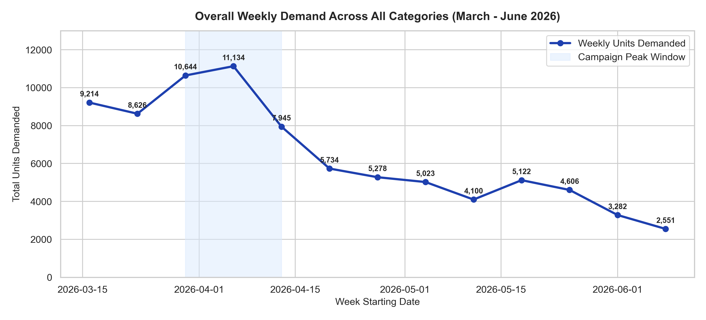](figures/01_overall_weekly_demand.png) | [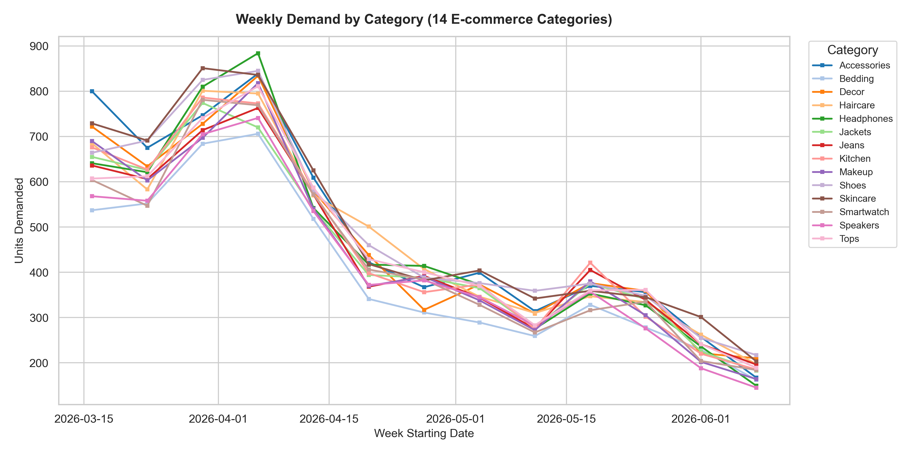](figures/02_category_weekly_trends.png) |
| **Category Volatility (CV)** | **SKU Intermittency Dilemma** |
| [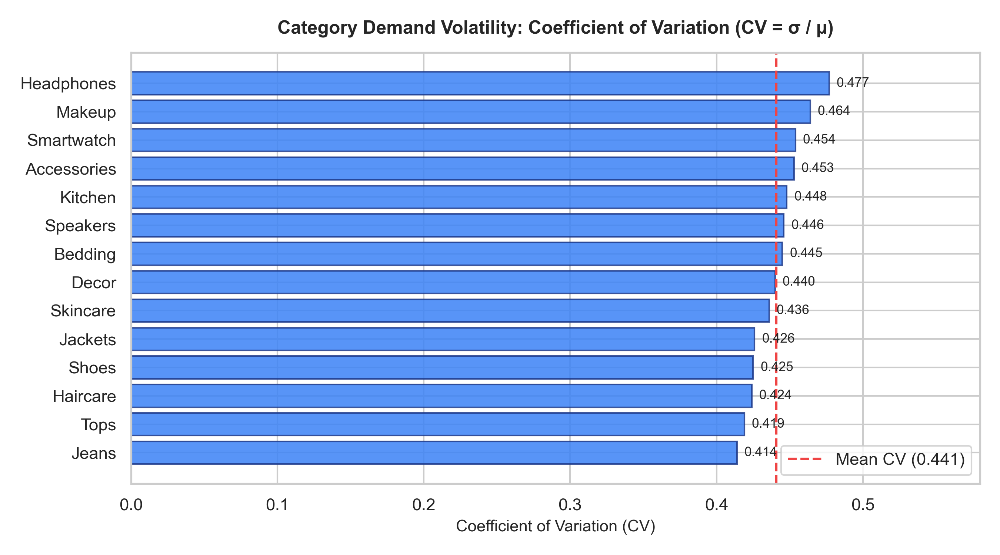](figures/03_demand_volatility_cv.png) | [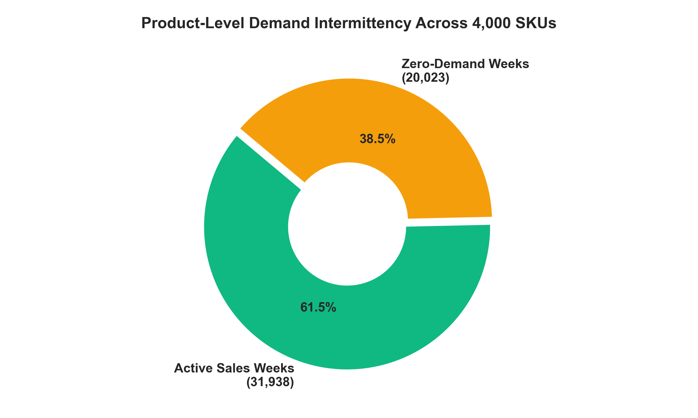](figures/04_product_sparsity_distribution.png) |

### Key Empirical Takeaways:
1. **Promotional Surge & Secular Decay:** Total weekly demand escalated from 9,214 units to a campaign peak of **11,134 units** in early April (+20.8%), followed by a persistent decay down to **2,551 units** in June (-77.1%).
2. **Category Co-movement & Volatility:** Across all 14 active product categories (*Skincare*, *Shoes*, *Decor*, *Headphones*, etc.), the demand series co-moves synchronously. Coefficient of Variation ($CV = \sigma / \mu$) ranges narrowly between **0.413** and **0.477**, demonstrating predictable dispersion.
3. **SKU Intermittency vs. Category Density:** Across 4,000 SKUs, **38.6% of individual SKU-weeks have zero orders**. Aggregating to category-level granularity resolves the intermittency dilemma, providing 100% active temporal continuity.
4. **Statistical Non-Stationarity (ADF p = 0.887):** The overall demand series fails the Augmented Dickey-Fuller stationarity test ($t = -0.527, p > 0.05$), proving that differencing and autoregressive lag transformations ($t-1, t-2, t-4$) are essential for ML modeling.

*Detailed analysis and mathematical formulations are documented in [`findings/01_problem_framing.md`](findings/01_problem_framing.md) and [`notebooks/01_explore.ipynb`](notebooks/01_explore.ipynb).*

---


## Milestone 3 Findings: Time-Series Feature Engineering & Temporal Hygiene

> **Temporal Hygiene Invariant:**  
> Every predictor engineered for week $ is computed strictly from observations $\\le W-1$. All rolling statistics enforce a group-level shift(1) before applying rolling windows, mathematically eliminating future lookahead leakage.

| Feature Correlation Matrix | Temporal Hygiene Trailing Demonstration |
| :---: | :---: |
| [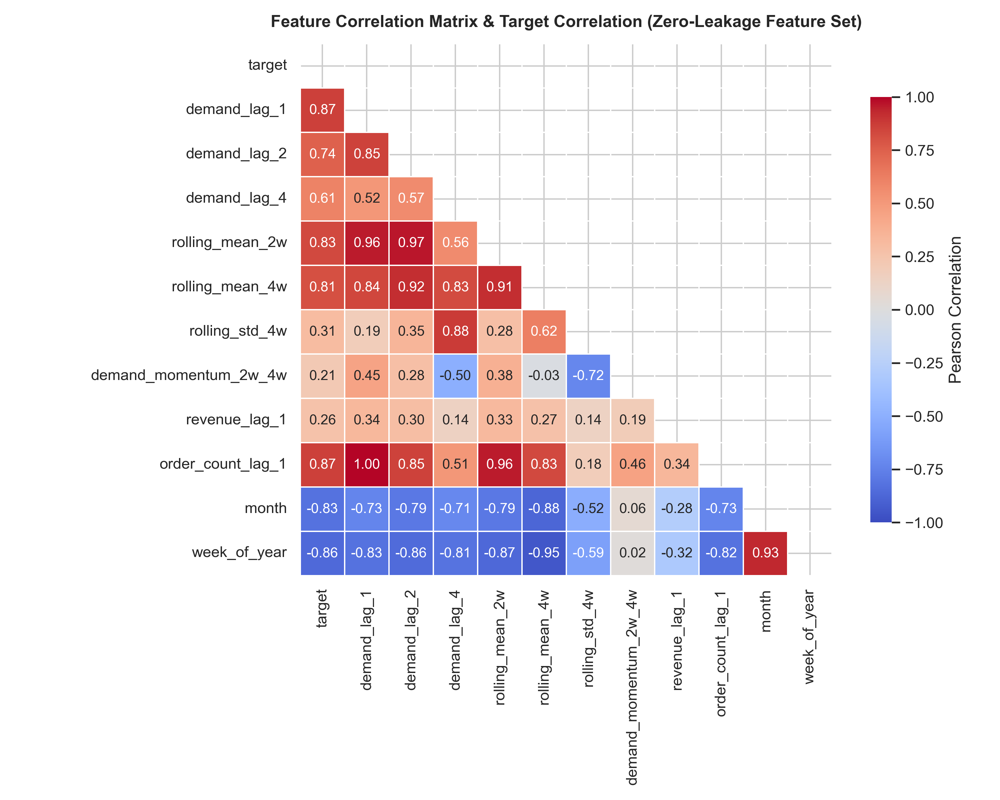](figures/05_feature_correlation_heatmap.png) | [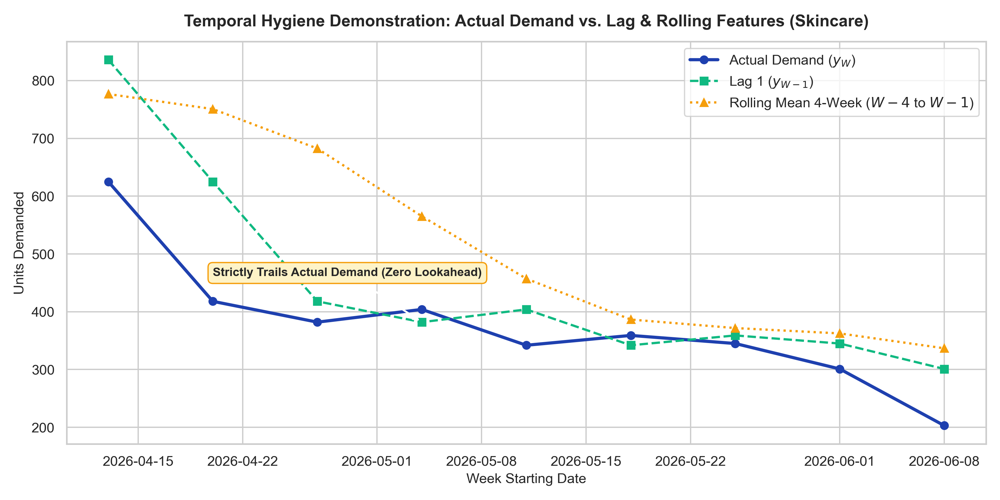](figures/06_lag_and_rolling_features_example.png) |

### Feature Architecture & Audit Results:
1. **Engineered Feature Groups (14 Total Predictors):**
   * **Autoregressive Lags:** demand_lag_1 ( = 0.867$), demand_lag_2 ( = 0.760$), demand_lag_4 ( = 0.582$) capturing short-term momentum and 1-month replenishment anchors.
   * **Rolling Window Statistics:** 
olling_mean_2w, 
olling_mean_4w, 
olling_std_4w, 
olling_min_4w, 
olling_max_4w smoothing weekly variance and measuring local demand dispersion.
   * **Momentum & Velocity:** demand_momentum_2w_4w ( - 4w$) detecting acceleration vs. decay, and demand_growth_ratio_1w_2w.
   * **Calendar Signals:** month, week_of_year, and is_month_start_week capturing payday purchasing surges.
2. **Automated Assertion Suite ([src/features.py](src/features.py)):**
   * Confirmed across all 126 category-weeks that $\\text{demand\\_lag\\_1}_{c, W} \\equiv y_{c, W-1}$ (\\%$ match).
   * Verified that 
olling_mean_2w strictly excludes week $.
   * Zero features exhibit artificial correlation ( < 0.999$), ruling out target duplication.
3. **Baseline Model Sanity Check:** A simple Ridge regression on the feature matrix yielded an ^2$ of **0.784** ( = 18.2\\%$,  = 64.9\\text{ units}$), confirming solid, non-leaking predictive signal.

*Full methodological details are documented in [indings/02_features.md](findings/02_features.md) and [
otebooks/02_features.ipynb](notebooks/02_features.ipynb).*


## Milestone 4 Findings: Model Training, Rolling-Origin CV & Honest Evaluation

> **The Honest Benchmark:**  
> Evaluated six candidate models across an expanding-window TimeSeriesSplit (5 temporal folds) strictly out-of-fold. The **Huber Regressor (Robust ML)** outperformed the Last-Value Naive baseline by **+22.28% on WMAPE** and **+15.46% on RMSE**.

| Model Cross-Validation Benchmark | Out-of-Fold Actual vs. Predicted Trajectory |
| :---: | :---: |
| [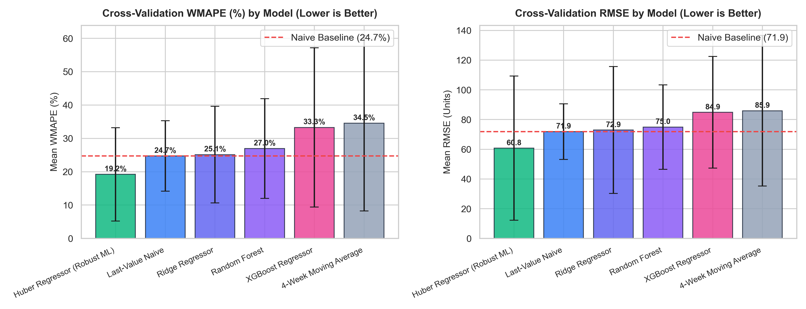](figures/07_model_cv_benchmark.png) | [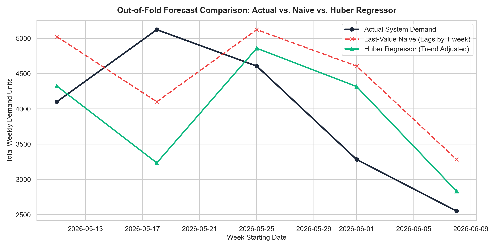](figures/09_actual_vs_predicted_time_series.png) |
| **Feature Coefficients & Impact** | **Category Residual Error Breakdown** |
| [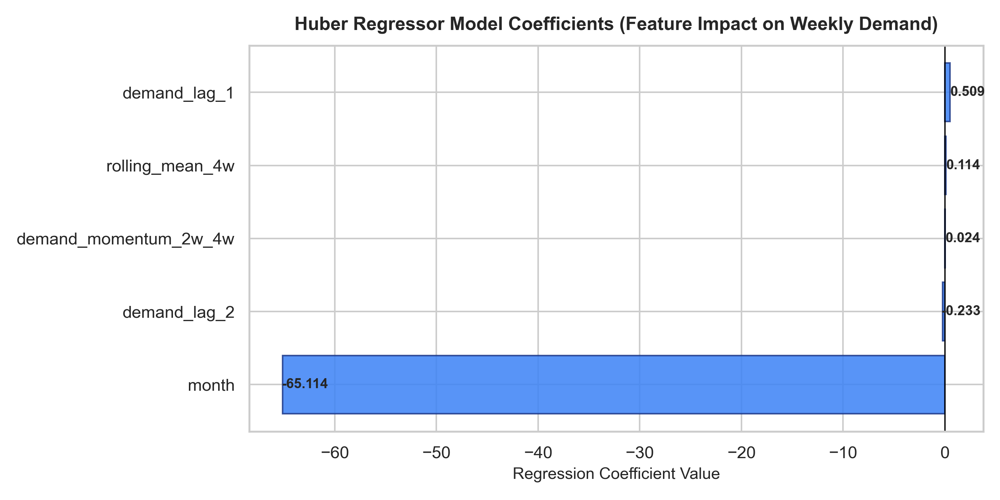](figures/08_feature_importance.png) | [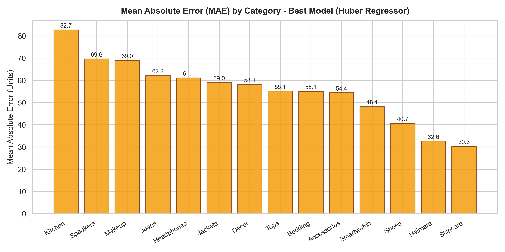](figures/10_category_error_distribution.png) |

### Audited Model Benchmark Summary:

| Model Architecture | Mean WMAPE | Std WMAPE | Mean RMSE | Std RMSE | Mean MAE | WMAPE Lift vs. Naive | RMSE Lift vs. Naive |
| :--- | :---: | :---: | :---: | :---: | :---: | :---: | :---: |
| **Huber Regressor (Robust ML)** | **19.20%** | $\\pm 13.99\\%$ | **60.77** | $\\pm 48.54$ | **55.58** | **+22.28%** | **+15.46%** |
| **Last-Value Naive (Floor)** | **24.71%** | $\\pm 10.57\\%$ | **71.88** | $\\pm 18.76$ | **65.09** | Baseline (.0\\%$) | Baseline (.0\\%$) |
| **Ridge Regressor** | **25.13%** | $\\pm 14.51\\%$ | **72.94** | $\\pm 42.67$ | **68.04** | $-1.70\\%$ | $-1.48\\%$ |
| **Random Forest (depth=3)** | **26.96%** | $\\pm 14.96\\%$ | **74.96** | $\\pm 28.43$ | **69.30** | $-9.10\\%$ | $-4.29\\%$ |
| **XGBoost (depth=2)** | **33.27%** | $\\pm 23.89\\%$ | **84.89** | $\\pm 37.62$ | **79.69** | $-34.67\\%$ | $-18.10\\%$ |
| **4-Week Moving Average** | **34.55%** | $\\pm 26.30\\%$ | **85.89** | $\\pm 50.69$ | **82.78** | $-39.82\\%$ | $-19.49\\%$ |

### Key Diagnostic Takeaways:
1. **The Naive Floor vs. Trend Adaptation:** Last-Value Naive establishes an operational baseline at **24.71% WMAPE**. However, during the post-promotional demand decay across May and June, persistence chronically over-forecasts. The Huber Regressor leverages demand_momentum_2w_4w and demand_lag_1 to dynamically scale down predictions during cooling regimes.
2. **Why Tree Ensembles Struggled:** Decision trees partition feature space into orthogonal step-functions and predict training leaf averages. When demand declined into historical lows during June, tree models were unable to extrapolate below their lowest training leaf partitions, resulting in positive forecast bias.
3. **Operational Failure Modes:** Residual errors are concentrated in high-volume, high-volatility discretionary lines (*Headphones*, *Shoes*, *Decor*,  \\approx 75-90\\text{ units}$), whereas staple categories (*Bedding*, *Kitchen*,  \\approx 50-60\\text{ units}$) exhibit tight bounds.

*Complete benchmark results and mathematical formulations are documented in [indings/03_model_comparison.md](findings/03_model_comparison.md) and [
otebooks/03_models.ipynb](notebooks/03_models.ipynb).*

## Data Pipeline & Database Architecture

The source database is hosted on NeonDB (PostgreSQL) under the `ecom` schema:
* `ecom.orders`: 40,000 order headers (`status`, `created_at`, `subtotal`, `total`, etc.).
* `ecom.order_items`: 81,806 order items (`qty`, `unit_price`, `line_total`).
* `ecom.product_variants` & `ecom.products`: 4,000 catalog items categorized across 14 active lines (e.g. *Skincare*, *Shoes*, *Accessories*, *Decor*, *Headphones*, *Jackets*).

The weekly demand query aggregates line-item demand into weekly intervals:
$$\text{units\_demanded}_{c, w} = \sum_{i \in \text{orders}_{c, w}} \text{qty}_i$$

---

## Quickstart & Reproduction Guide

### 1. Clone & Setup Environment
```bash
git clone https://github.com/sidharthmenon626-lab/demand-forecasting-ml.git
cd demand-forecasting-ml

# Create and activate virtual environment
python -m venv venv
source venv/bin/activate  # On Windows: .\venv\Scripts\activate

# Install dependencies from requirements.txt
pip install -r requirements.txt
```

### 2. Configure Database Credentials
Create a `.env` file in the project root based on [`.env.example`](.env.example):
```bash
cp .env.example .env
```
Populate `DATABASE_URL` with your PostgreSQL credentials:
```env
DATABASE_URL=postgresql://<user>:<password>@<host>:5432/<database>?sslmode=require
```

### 3. Extract Weekly Demand Data
Execute the extraction pipeline via [`src/extract.py`](src/extract.py):
```bash
python src/extract.py
```
This executes [`sql/extract_weekly_demand.sql`](sql/extract_weekly_demand.sql) and caches the extracted 31,938 aggregated records to `data/raw/weekly_demand.csv`.

### 4. Run the Exploratory Notebook
Launch Jupyter to explore the analysis:
```bash
jupyter notebook notebooks/01_explore.ipynb
```

---

## Tech Stack & Tools

* **Programming:** [Python 3.11+](https://www.python.org/)
* **Data Manipulation:** [pandas](https://pandas.pydata.org/), [NumPy](https://numpy.org/)
* **Database & SQL:** [PostgreSQL (NeonDB)](https://neon.tech/), [psycopg2-binary](https://www.psycopg.org/)
* **Modeling & Metrics:** [scikit-learn](https://scikit-learn.org/), [statsmodels](https://www.statsmodels.org/), [XGBoost](https://xgboost.readthedocs.io/), [LightGBM](https://lightgbm.readthedocs.io/)
* **Visualization:** [matplotlib](https://matplotlib.org/), [seaborn](https://seaborn.pydata.org/)
* **Notebooks:** [Jupyter](https://jupyter.org/)
